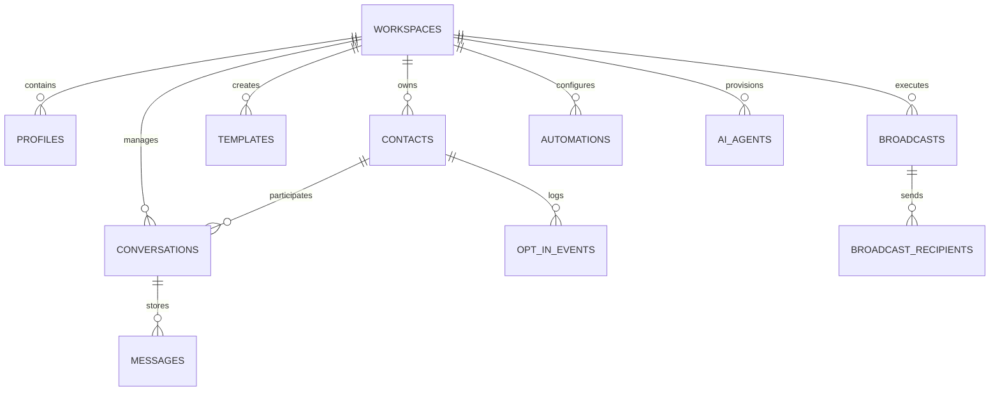

# Database Schema & Entity Relationship Specification
**AutoWhatsApp AI Database Architecture (PostgreSQL / Supabase)**

---

## 1. Entity Overview & Relationships

---

## 2. Table Specifications

### 2.1 `workspaces`
Primary tenant boundary.
- `id` (UUID, PK)
- `name` (VARCHAR)
- `slug` (VARCHAR, UNIQUE)
- `industry` (VARCHAR)
- `waba_id` (VARCHAR) - WhatsApp Business Account ID
- `phone_number_id` (VARCHAR)
- `display_phone_number` (VARCHAR)
- `quality_rating` (VARCHAR: GREEN, YELLOW, RED, UNKNOWN)
- `messaging_tier` (VARCHAR: TIER_250, TIER_1K, TIER_10K, TIER_100K, TIER_UNLIMITED)
- `access_token` (TEXT, Encrypted)
- `webhook_verify_token` (VARCHAR)
- `created_at`, `updated_at`

### 2.2 `contacts`
Customer registry per workspace.
- `id` (UUID, PK)
- `workspace_id` (UUID, FK)
- `phone_number` (VARCHAR, E.164 standard)
- `name` (VARCHAR)
- `email` (VARCHAR)
- `opt_in_status` (BOOLEAN, DEFAULT FALSE)
- `opt_in_timestamp` (TIMESTAMPTZ)
- `opt_in_source` (VARCHAR)
- `last_message_at` (TIMESTAMPTZ)
- `tags` (TEXT[])
- `custom_attributes` (JSONB)
- `is_blocked` (BOOLEAN, DEFAULT FALSE)

### 2.3 `opt_in_events`
Immutable compliance audit log.
- `id` (UUID, PK)
- `workspace_id` (UUID, FK)
- `contact_id` (UUID, FK)
- `event_type` (VARCHAR: OPT_IN, OPT_OUT, KEYWORD_STOP, CONSENT_FORM)
- `source` (VARCHAR)
- `ip_address` (INET)
- `user_agent` (TEXT)
- `metadata` (JSONB)
- `created_at` (TIMESTAMPTZ)

### 2.4 `conversations`
Chat sessions.
- `id` (UUID, PK)
- `workspace_id` (UUID, FK)
- `contact_id` (UUID, FK)
- `status` (VARCHAR: OPEN, RESOLVED, WAITING_AGENT)
- `assigned_agent_id` (UUID, FK)
- `window_expires_at` (TIMESTAMPTZ) - 24-hour service window mark
- `unread_count` (INT)
- `last_message_preview` (TEXT)
- `updated_at` (TIMESTAMPTZ)

### 2.5 `messages`
Individual WhatsApp messages.
- `id` (UUID, PK)
- `conversation_id` (UUID, FK)
- `workspace_id` (UUID, FK)
- `direction` (VARCHAR: INBOUND, OUTBOUND)
- `sender_type` (VARCHAR: USER, AGENT, AI, SYSTEM)
- `message_type` (VARCHAR: TEXT, IMAGE, DOCUMENT, AUDIO, VIDEO, TEMPLATE, INTERACTIVE)
- `body` (TEXT)
- `media_url` (TEXT)
- `wa_message_id` (VARCHAR) - Meta wamid
- `status` (VARCHAR: SENT, DELIVERED, READ, FAILED)
- `error_code` (INT)
- `error_message` (TEXT)
- `created_at` (TIMESTAMPTZ)

### 2.6 `templates`
Synced WhatsApp message templates.
- `id` (UUID, PK)
- `workspace_id` (UUID, FK)
- `name` (VARCHAR)
- `category` (VARCHAR: MARKETING, UTILITY, AUTHENTICATION)
- `language` (VARCHAR)
- `status` (VARCHAR: DRAFT, PENDING, APPROVED, REJECTED)
- `header_type` (VARCHAR: NONE, TEXT, IMAGE, VIDEO, DOCUMENT)
- `header_content` (TEXT)
- `body_text` (TEXT)
- `footer_text` (TEXT)
- `buttons` (JSONB)
- `rejection_reason` (TEXT)
- `meta_template_id` (VARCHAR)

### 2.7 `broadcasts`
Mass campaign dispatches.
- `id` (UUID, PK)
- `workspace_id` (UUID, FK)
- `name` (VARCHAR)
- `template_id` (UUID, FK)
- `status` (VARCHAR: DRAFT, SCHEDULED, SENDING, COMPLETED, PAUSED)
- `total_recipients` (INT)
- `sent_count` (INT)
- `delivered_count` (INT)
- `read_count` (INT)
- `failed_count` (INT)
- `scheduled_at` (TIMESTAMPTZ)
- `completed_at` (TIMESTAMPTZ)
